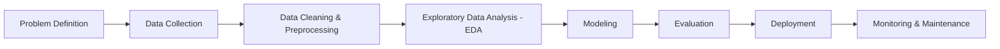

## Bank personal loan

### About this project

### Structure
  1 - Problem definition & Business understanding
  2 - Data Collection
  3 - Data Cleaning & Preprocessing
  4 - Exploratory Data Analysis (EDA)
  5 - Modeling
  6 - Evaluation
   - Explainability & Interpretability
   - Scenario Simulations
   - Dashboard Development (Streamlit)
   - Deployment & Sharing
  7 - Deployment - TO DO
  8 - Monitoring & Maintenance - TO DO 

#### 1 - Problem definition & Business understanding

#### 2 - Data Collection

#### 3 - Data Cleaning & Preprocessing

#### 4 - Exploratory Data Analysis (EDA)

#### 5 - Modeling

#### 6 - Evaluation

#### 7 - Deployment - TO DO

#### 8 - Monitoring & Maintenance - TO DO 
